# Email Phishing Detection & Response

## Mô tả kịch bản

Hệ thống tự động giám sát hộp thư Gmail, phân tích email nghi ngờ phishing: kiểm tra URL, IP người gửi, hash file đính kèm qua VirusTotal. Nếu phát hiện độc hại → tự động block IP qua Wazuh Active Response + xóa email + gửi báo cáo SOC.

**MITRE ATT&CK:** T1566.001 (Spearphishing Attachment), T1566.002 (Spearphishing Link)

---

## 1. Cấu hình Wazuh

### 1.1 Active Response – `netsh` block IP

Cấu hình lệnh `netsh` trên Wazuh Manager để tự động chặn IP độc hại trên Windows agent.


### 1.2 Rule 100050 – SOAR block IP

Rule được kích hoạt khi Wazuh nhận log "WAZUH ACTIVE RESPONSE BLOCKED IP" từ agent.


### 1.3 Wazuh Agent – Windows 10

Agent `DESKTOP-7FF2J6R` (192.168.1.13) kết nối thành công với Wazuh Manager, status **Active**.

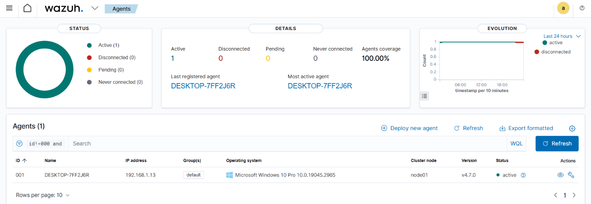

---

## 2. Shuffle Workflow

### 2.1 Tổng quan workflow

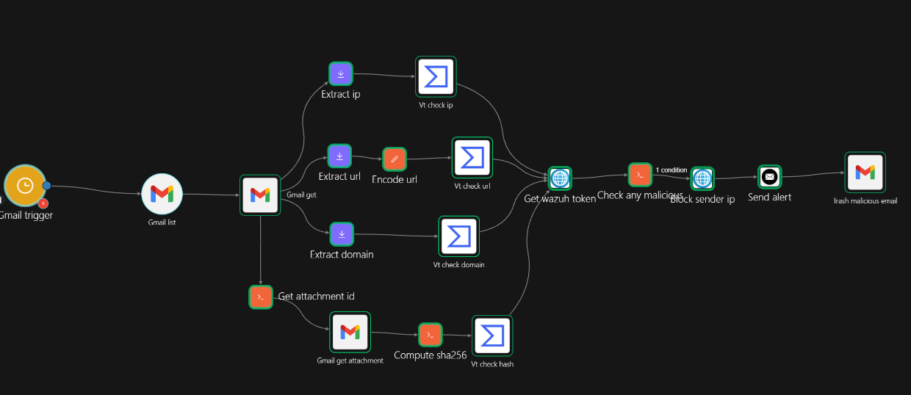

Workflow gồm 2 luồng song song sau bước `gmail_get`, hội tụ về node `check_any_malicious` để quyết định phản ứng:

| Bước | Node | Mô tả |
|------|------|-------|
| 1 | **Gmail trigger** | Kích hoạt theo lịch (polling), quét hộp thư tìm email chưa đọc |
| 2 | **Gmail list** | Lấy danh sách message ID của email mới nhất (`is:unread`) |
| 3 | **Gmail get** | Đọc toàn bộ nội dung email: header, body, snippet, parts |
| 4a | **Extract ip** | Trích xuất IP người gửi từ body email bằng regex |
| 4b | **Extract url** | Trích xuất URL từ body email bằng regex |
| 4c | **Extract domain** | Trích xuất domain từ URL đã extract |
| 4d | **Get attachment id** | Trích xuất `attachmentId` từ phần `parts` của email |
| 5a | **Vt check ip** | Gọi VirusTotal API kiểm tra IP, lấy `last_analysis_stats` |
| 5b | **Encode url** | Encode URL sang base64 để chuẩn hóa cho VT API endpoint `/urls/{id}` |
| 5c | **Vt check domain** | Gọi VirusTotal API kiểm tra domain, lấy `categories` và `last_analysis_stats` |
| 5d | **Gmail get attachment** | Download file đính kèm dạng base64url từ Gmail API |
| 6b | **Vt check url** | Gọi VirusTotal API kiểm tra URL đã encode |
| 6d | **Compute sha256** | Giải mã base64url → bytes → tính SHA256 bằng Python `hashlib` |
| 7d | **Vt check hash** | Gọi VirusTotal API kiểm tra SHA256 hash của file đính kèm |
| 8 | **Get wazuh token** | Xác thực với Wazuh API để lấy JWT token cho bước active response |
| 9 | **Check any malicious** | Tổng hợp kết quả 4 nguồn (URL/IP/domain/hash), trả về `MALICIOUS` hoặc `CLEAN` |
| 10 | **Block sender ip** | Gọi Wazuh Active Response API (`PUT /active-response`) với lệnh `netsh` block IP |
| 11 | **Send alert** | Gửi email báo cáo tổng hợp đến SOC Analyst |
| 12 | **Trash malicious email** | Gọi Gmail API xóa email phishing khỏi hộp thư |

> **Lưu ý thiết kế:** Bước 4a–4d chạy song song ngay sau `gmail_get`, giúp rút ngắn thời gian xử lý. Toàn bộ kết quả VT được tổng hợp tại `check_any_malicious` — chỉ khi có ít nhất 1 nguồn trả về malicious thì mới kích hoạt block và alert, tránh false positive.

### 2.2 Script extract Attachment ID

Script Python trong Shuffle trích xuất `attachmentId` từ kết quả `gmail_get`.

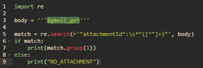

### 2.3 Script tính SHA256 từ base64

Tải file đính kèm dạng base64 từ Gmail API, giải mã và tính SHA256 để kiểm tra trên VirusTotal.

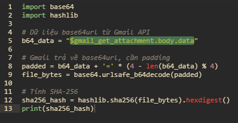

### 2.4 Condition – check any malicious

Nếu bất kỳ nguồn nào (URL/IP/domain/hash) trả về `MALICIOUS` → kích hoạt nhánh block và alert.

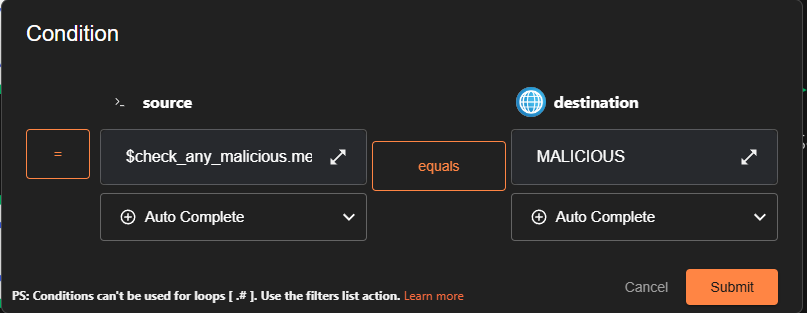

---

## 3. Thực thi kịch bản

### 3.1 Gửi email phishing mô phỏng

Email phishing được soạn với nội dung chứa URL độc hại (`http://malware.wicar.org/data/eicar.com`), IP (`203.0.113.45`) và hash file.

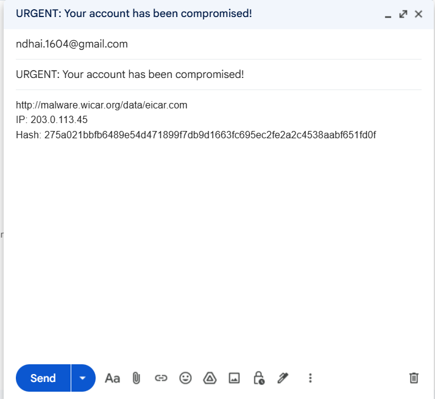

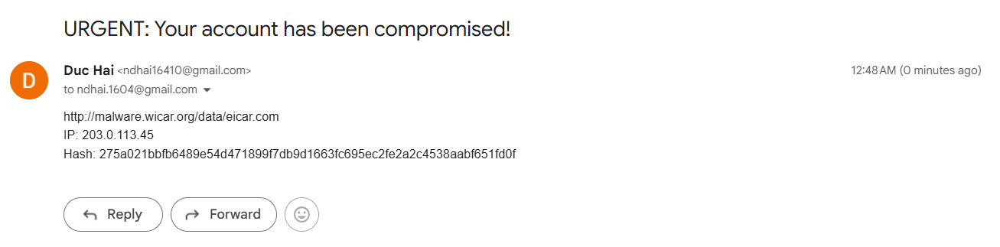

---

## 4. Phân tích trong Shuffle

### 4.1 Gmail list – phát hiện email mới

Shuffle lấy email mới nhất từ Gmail (filter `is:unread`), nhận được message ID `19d7aa583f7df82d`.

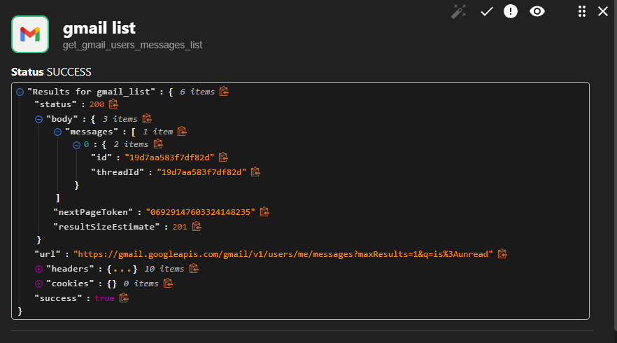

### 4.2 Gmail get – đọc nội dung email

Lấy đầy đủ nội dung email: snippet chứa URL và IP độc hại, payload chứa thông tin file đính kèm.

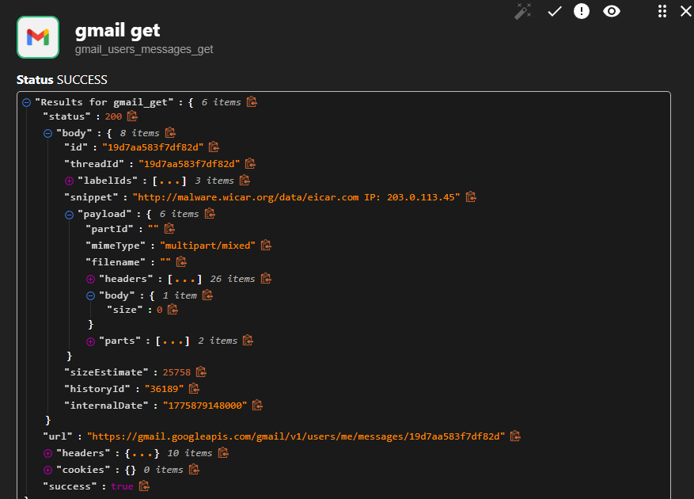

### 4.3 Gmail get attachment – lấy file đính kèm

Download file đính kèm dạng base64 để tính hash SHA256.

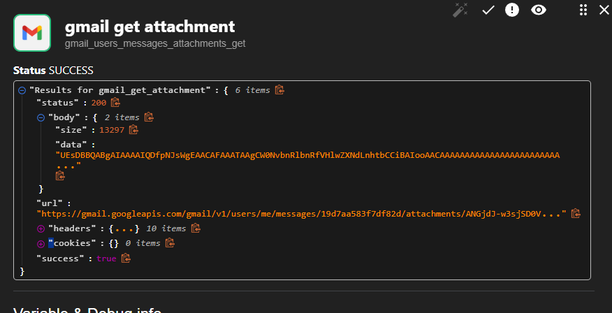

### 4.4 VirusTotal – kiểm tra URL

URL `http://malware.wicar.org/data/eicar.com` bị phát hiện **malicious bởi 18 engines**.

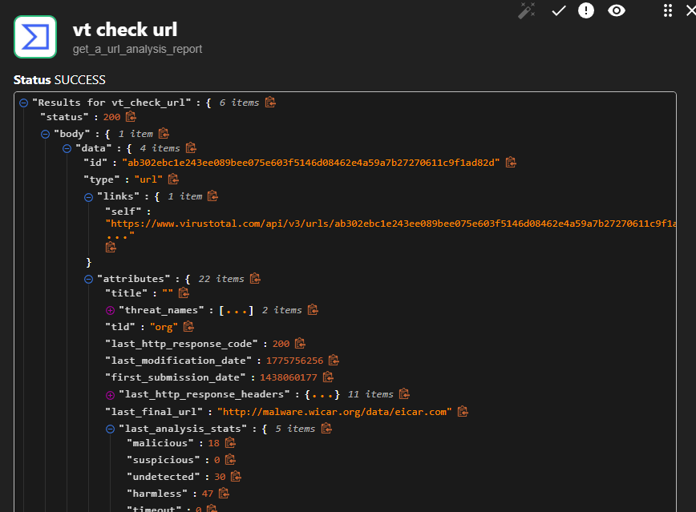

### 4.5 VirusTotal – kiểm tra IP

IP `203.0.113.45` được kiểm tra – kết quả 0 malicious engines (IP TEST-NET, dùng cho lab).

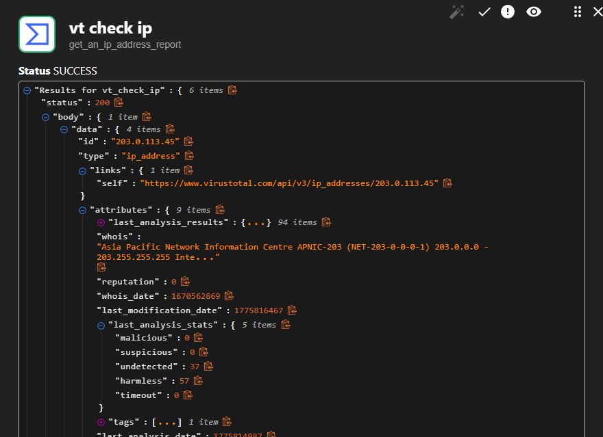

### 4.6 VirusTotal – kiểm tra hash file đính kèm

File đính kèm `.docx` được kiểm tra hash, nhận diện là `equ51.exe` (Microsoft Word 2007+ format fake).

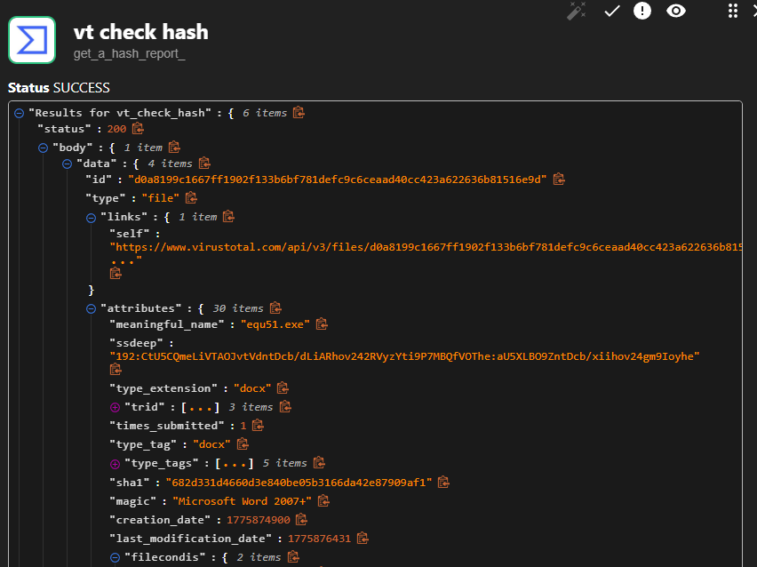

### 4.7 VirusTotal – kiểm tra domain

Domain `wicar.org` bị phân loại là **Malware Sites** (Webroot) và **command and control** (Sophos).

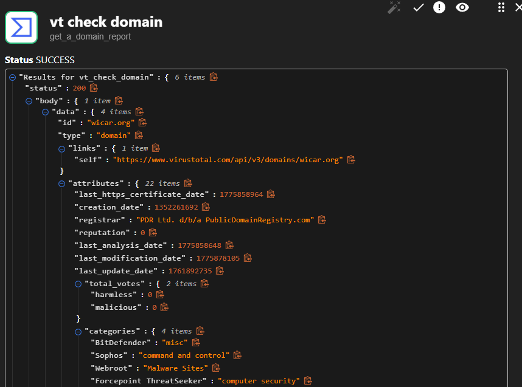

### 4.8 Tổng hợp – check_any_malicious = MALICIOUS

Script tổng hợp kết quả VT từ tất cả nguồn → trả về `MALICIOUS`, kích hoạt nhánh phản ứng.

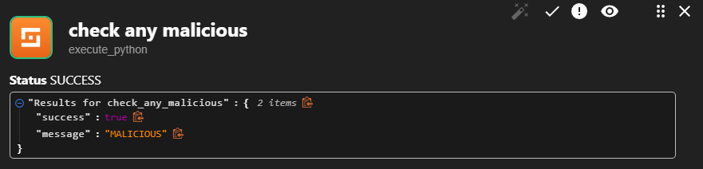

---

## 5. Phản ứng tự động

### 5.1 Block IP qua Wazuh Active Response

Shuffle gọi Wazuh API để kích hoạt `netsh` block IP `203.0.113.45` trên agent – `AR command was sent to all agents`, `total_affected_items: 1`.

### 5.2 Wazuh Alert – IP bị chặn

Wazuh ghi nhận alert rule **100050** (level 14): "SOAR Action: Hệ thống đã tự động chặn IP độc hại".

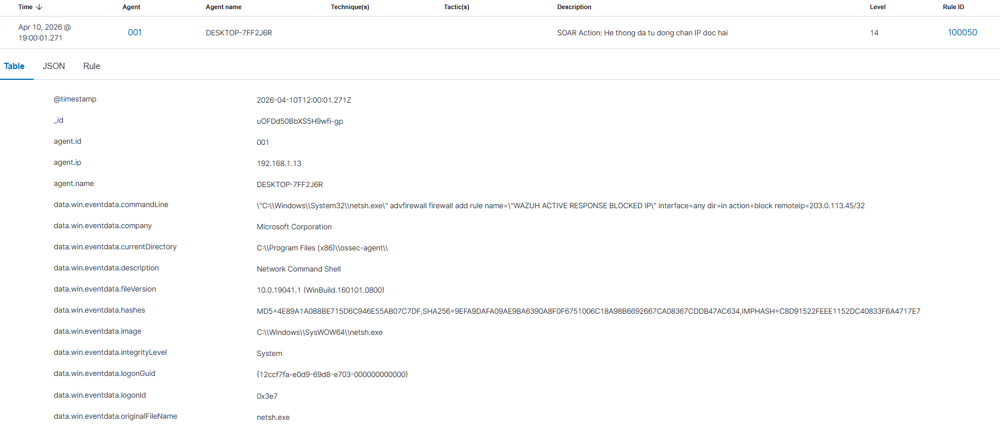

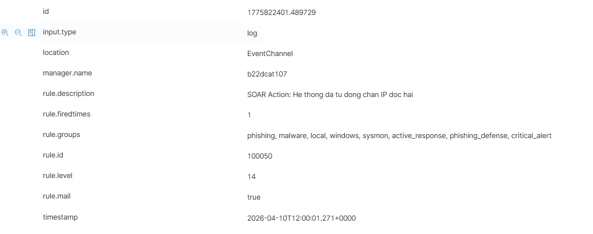

### 5.3 Windows Firewall – xác nhận block

Windows Defender Firewall tạo inbound rule **"WAZUH ACTIVE RESPONSE BLOCKED IP"**, chặn remote IP `203.0.113.45`.


### 5.4 Email báo cáo SOC

Shuffle gửi email tổng hợp đến SOC Analyst: URL malicious (18 engines), IP (0 engines), hash (0 engines), kèm xác nhận Active Response thành công.

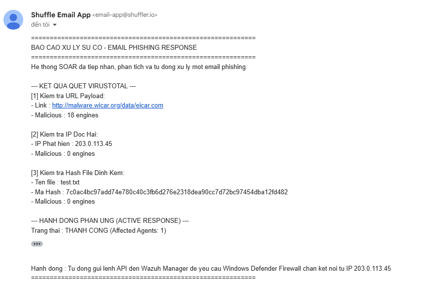

---

## Tóm tắt luồng xử lý

```
Gmail trigger (poll unread)
    → Gmail list → Gmail get → Extract URL / IP / domain / attachment
    → Parallel: VT check URL + VT check IP + VT check domain
    → Get attachment → Compute SHA256 → VT check hash
    → check_any_malicious()
        [MALICIOUS] → block_sender_ip (Wazuh AR) → trash email → Send alert
        [CLEAN]     → No action
```